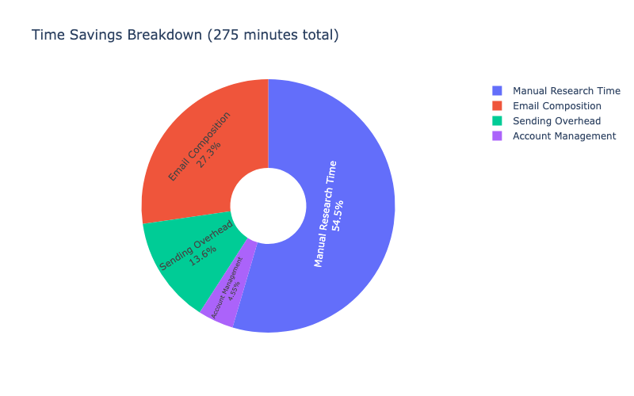
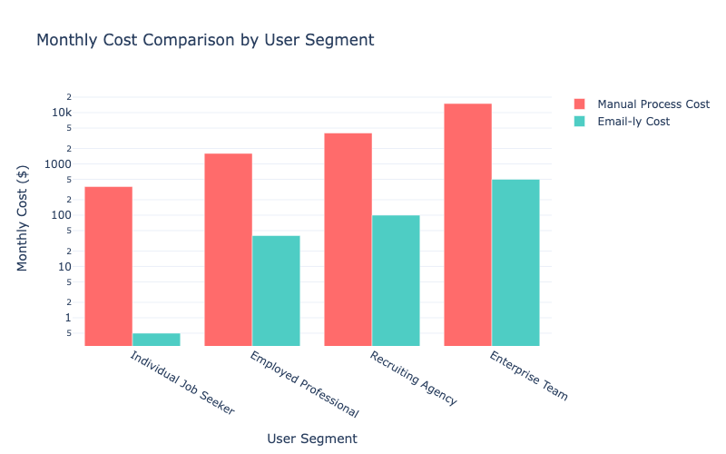
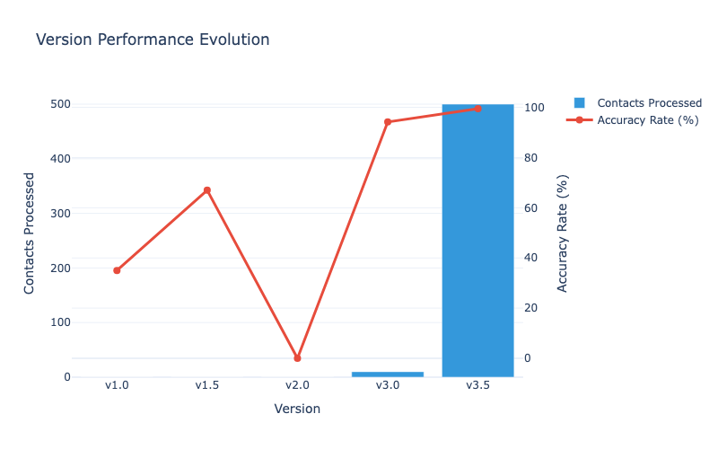

# 🧠 Portfolio Project Entry: AI Powered – Outreach Automation Bot for Gmail

---

## 🟩 WHAT

**Problem:**  
Manual job outreach is slow, repetitive, and expensive. Traditional cold outreach requires hours of manual email writing, tracking, and follow-up—often costing $200–$500/month for recruiter services or SaaS tools.  
**Direct, personalized outreach** is crucial for standing out, but doing it at scale is nearly impossible by hand.

---

## 🟦 HOW

**Evolution:**
- **v1.0:** OCR tools (Tesseract, Apple Vision, Microsoft OCR) for resume/contact extraction—quickly hit accuracy and formatting limits.
- **v2.0:** DOM scraping and bookmarklets for LinkedIn/Apollo—HTML changes and anti-bot measures broke reliability.
- **v3.0:** Apollo API access—limited to 10 contacts/page, not scalable for bulk outreach.
- **v3.5:** **CSV bulk export automation**:  
  - **Python** parses Apollo CSVs  
  - **Gmail API** + OAuth 2.0 for secure, multi-account draft creation  
  - **Async drafting** for speed  
  - **CLI interface** prompts for company, position, template, and Gmail account  
  - **Personalized drafts** with resume/cover letter attachments  
  - **Multi-account support** and job-title input  
  - **File export** for tracking outreach per company

**Tools Used:**  
Python, Gmail API, OAuth 2.0, Pandas, Apollo.io, Plotly Dash (KPI dashboard), Mermaid (automation flow), CLI, Jinja2 (templating), AsyncIO.

**Flow:**  
CSV ingest → Parse → User prompt (company, position, template) → Gmail account auth → Generate personalized drafts (with attachments) → Export logs.

**Security:**  
No confidential code or credentials shown; core logic is proprietary.

---

## 🟨 RESULTS

- ⏱️ **Drafted 500+ personalized emails in under 15 minutes** (vs. 10+ hours manual)
- 💰 **Equivalent to $400–$800/month saved** vs. recruiter/SaaS tools
- 📈 **Time savings:**  
   <!-- Expandable modal -->
- 📊 **Cost Savings:**  
   <!-- Expandable modal -->
- ⏳ **Time Efficiency:**  
   <!-- Expandable modal -->
- 🗂️ **Version Evolution:**  
   <!-- Expandable modal -->
- 🧭 **Automation Flow (Mermaid):**  
  ```mermaid
  flowchart TD
      A[CSV Ingest] --> B[Parse & Normalize]
      B --> C[User Prompt: Company/Position/Template]
      C --> D[Gmail Auth]
      D --> E[Draft Creation (Async)]
      E --> F[Export Log]
  ```

---

## 🟪 METADATA

- 🏷️ **Categories:** `Robotics`, `Data Analytics & Coding`
- 🏁 **Status:** Actively improving – desktop GUI in development
- ⚠️ **Confidentiality:** No sensitive logic or core code displayed; helper logic only.
- 🔏 **Licensing:** Internal use, not for redistribution.

---

**Expand any image or diagram above for a closer look at the automation, analytics, and workflow!**

---

**Reference:**
- [Project Report (docx)](project-images/Emailly_v3.5.2_Project_Report.docx)
